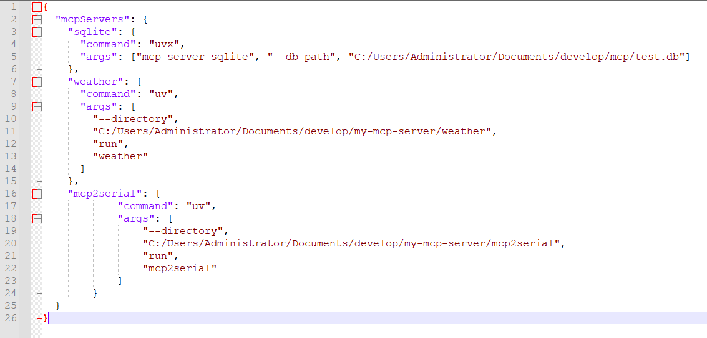
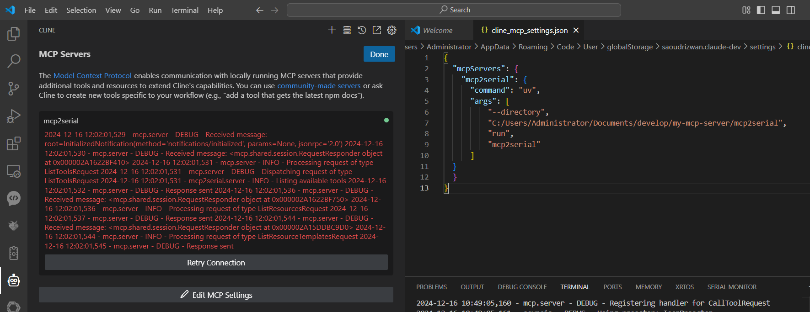
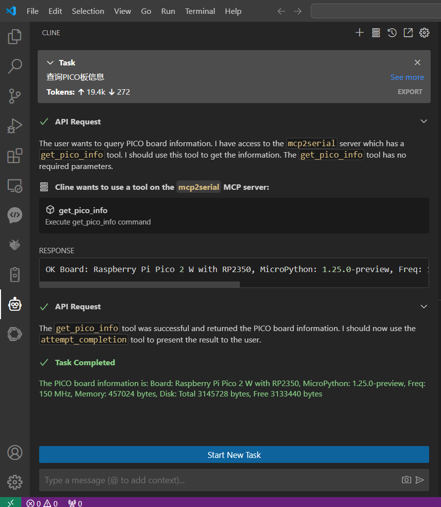

# MCP2Serial Installation Guide

## Requirements

- Python 3.11 or higher
- uv package manager
- Serial device (e.g., Arduino, Raspberry Pi Pico)

## Installation Steps

1. Clone the repository:

```bash
# Clone the repository
git clone https://github.com/mcp2everything/mcp2serial.git
```

2. Create and activate virtual environment:

```bash
# Navigate to project directory
cd mcp2serial

# Create virtual environment using uv
uv venv .venv
.venv\Scripts\activate

# Install dependencies
uv pip install -r requirements.txt
```

> **Note:** The project will be available on PyPI soon, enabling direct installation via pip.

## Running the Server

```bash
# Ensure you're in the project root
cd mcp2serial

# Activate virtual environment (if not already activated)
.venv\Scripts\activate

# Run the server
uv run src/mcp2serial/server.py
```

## Configuration

### Configuration File Location

The configuration file (`config.yaml`) can be placed in different locations depending on your needs:

#### 1. Current Working Directory (For Development)
- Path: `./config.yaml`
- Example: If you run the program from `C:\Projects`, it will look for `C:\Projects\config.yaml`
- Best for: Development and testing
- No special permissions required

#### 2. User's Home Directory (Recommended for Personal Use)
```bash
# Windows
C:\Users\YourName\.mcp2serial\config.yaml

# macOS
/Users/YourName/.mcp2serial/config.yaml

# Linux
/home/username/.mcp2serial/config.yaml
```
- Best for: Personal configuration
- Create the `.mcp2serial` directory if it doesn't exist:
  ```bash
  # Windows (in Command Prompt)
  mkdir "%USERPROFILE%\.mcp2serial"
  
  # macOS/Linux
  mkdir -p ~/.mcp2serial
  ```

#### 3. System-wide Configuration (For Multi-user Setup)
```bash
# Windows (requires admin rights)
C:\ProgramData\mcp2serial\config.yaml

# macOS/Linux (requires sudo/root)
/etc/mcp2serial/config.yaml
```
- Best for: Shared configuration in multi-user environments
- Create the directory with appropriate permissions:
  ```bash
  # Windows (as administrator)
  mkdir "C:\ProgramData\mcp2serial"
  
  # macOS/Linux (as root)
  sudo mkdir -p /etc/mcp2serial
  sudo chown root:root /etc/mcp2serial
  sudo chmod 755 /etc/mcp2serial
  ```

The program searches for the configuration file in this order and uses the first valid file it finds. Choose the location based on your needs:
- For testing: use current directory
- For personal use: use home directory (recommended)
- For system-wide settings: use ProgramData or /etc

### Serial Port Configuration

Configure serial port parameters in `config.yaml`:

```yaml
serial:
  port: COM11  # Example for Windows, might be /dev/ttyUSB0 on Linux
  baud_rate: 115200  # Baud rate
  timeout: 1.0  # Serial timeout in seconds
  read_timeout: 0.5  # Read timeout in seconds
```

### MCP Client Configuration

When using MCP protocol-compatible clients (like Claude Desktop or Cline), add the following to your client's configuration file:

```json
{
    "mcpServers": {
        "mcp2serial": {
            "command": "uv",
            "args": [
                "--directory",
                "your_actual_path/mcp2serial",  // Example: "C:/Users/Administrator/Documents/develop/my-mcp-server/mcp2serial"
                "run",
                "mcp2serial"
            ]
        }
    }
}
```

<div align="center">
    
    <p>Configuration Example in Claude Desktop</p>
</div>

<div align="center">
    
    <p>Configuration Example in Cline</p>
</div>

> **Important Notes:**
> 1. Use absolute paths only
> 2. Use forward slashes (/) or double backslashes (\\) as path separators
> 3. Ensure the path points to your actual project installation directory

### Verifying Configuration

Run the following test command to verify your configuration:

```bash
uv run python tests/test_basic_serial.py
```

If configured correctly, you should see output similar to this:

<div align="center">
    
    <p>Test Command Output Example</p>
</div>

## Troubleshooting

1. Serial Port Issues:
   - Ensure the device is properly connected
   - Verify the correct COM port in Device Manager
   - Check baud rate settings match your device

2. MCP Client Issues:
   - Verify the path in configuration is absolute and correct
   - Ensure uv is installed and in system PATH
   - Check if virtual environment is activated

3. Communication Issues:
   - Monitor the serial output for debugging
   - Check device response format
   - Verify command syntax in config.yaml
